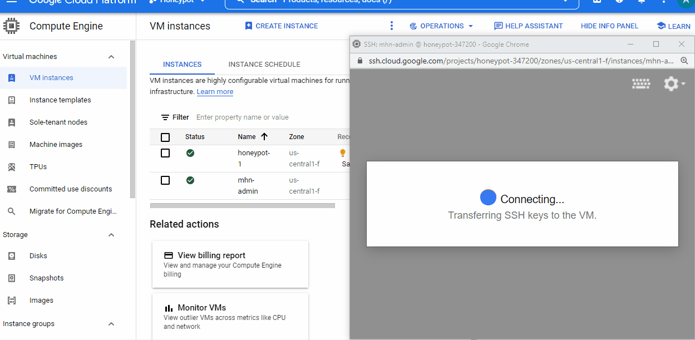
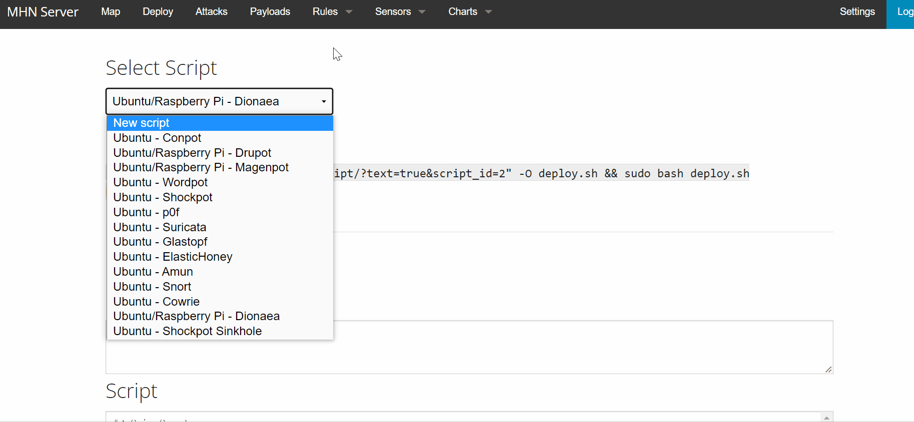
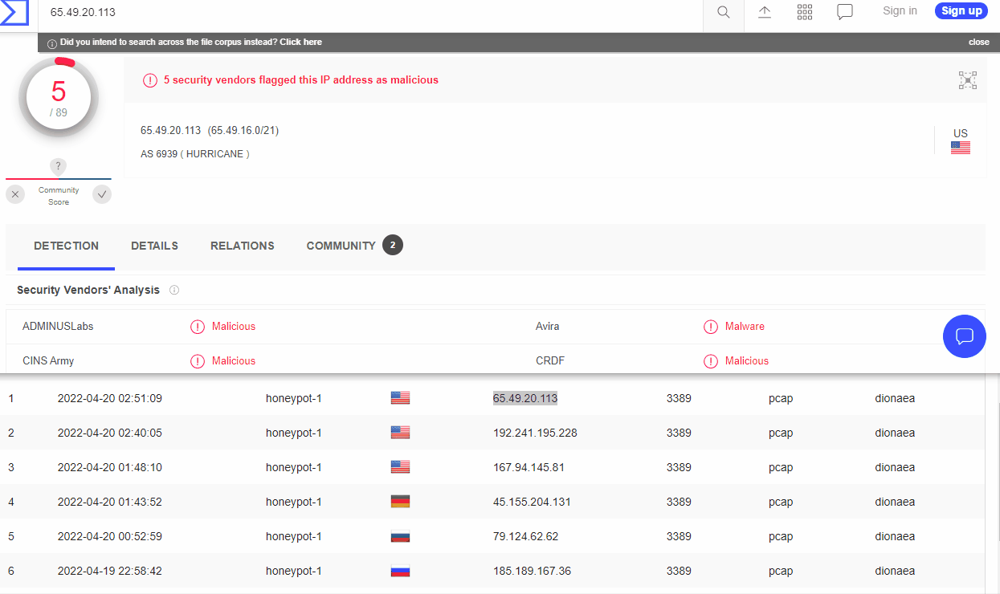

Stand up a basic honeypot deployment using a well-supported open source honeypot: Modern Honey Network (MHN) and demonstrate its effectiveness at detecting and/or collecting data about an attack.

MHN Admin Deployment
To run MHN, we'll need to setup at least two VMs: the single Admin VM and at least one Honeypot VM.

Dioanaea Honeypot Deployment
Execute wget with a unique token string command inside the honeypot VM to install the Dionaea software.

Database Backup (session.json)
Export data collected from the honeypot.

(optional) Malware Capture and Identification
Search for malware sample in a database like VirusTotal.

